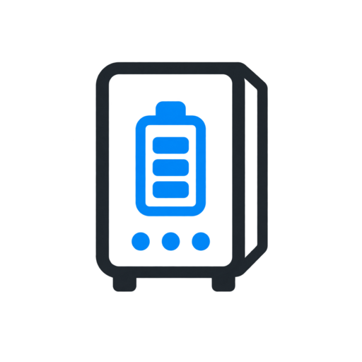

# Stark SolarPower for Home Assistant



Custom Home Assistant integration for **STARK Country Online** UPS devices monitored through the SolarPower / ShineMonitor cloud backend.

## Status

Current production baseline: **v1.9.4** with the integration-owned UPS panel UI **v0.9.4**.

The integration has been field-tested on two STARK Country Online 1000 VA UPS devices with SolarPower Wi-Fi cards.

## Features

- Cloud polling every 60 seconds.
- Read-only operation: the integration does not send UPS control or configuration commands.
- Automatic device discovery from the SolarPower account.
- Stable device identity based on Wi-Fi module PN.
- Input/output voltage and frequency.
- Output current and load.
- Battery voltage and charge.
- Positive/negative DC bus voltage and four internal temperature channels.
- Optional vendor RAW battery/runtime and internal power-stage/relay diagnostics from the detailed SolarPower endpoint.
- Operating mode and on-battery state.
- Cloud telemetry availability.
- UPS data timestamp and data age.
- Stale-data protection: operational entities become unavailable when cloud data is too old.
- Transition event entities for battery mode, explicit Fault Mode, cloud telemetry, data freshness and optional extended-telemetry health.
- Integration-owned mobile-first UPS panel at `/dashboard-ups`.
- Manual **Refresh all UPS** button.
- HTTPS transport when supported by the SolarPower endpoint.
- Detailed SolarPower telemetry is normally sampled every 5 minutes; while a UPS reports Battery Mode it is sampled every 60 seconds so remaining runtime follows the physical display.
- Failed detailed telemetry is retried on the next normal 60-second coordinator pass.
- Diagnostics retain the full normalized detailed field set with credentials and tokens excluded.

## Integration-owned UPS panel

The integration ships its own dedicated Home Assistant panel.

Navigation contract:

- route: `/dashboard-ups`;
- owner: `stark_solarpower`;
- sidebar title: `ИБП Stark`;
- icon: `mdi:battery-charging`;
- preferred view: `overview`;
- panel UI version: `0.9.4`;
- persistent device selector: `UPS Интернет / UPS Котёл`;
- product artwork: `Stark Country 1000 ONLINE (16A)`.

The panel is designed mobile-first for iPhone Pro Max in portrait orientation and uses one reusable UPS template for every Stark SolarPower device discovered through Home Assistant's registries. UI v0.9.4 keeps the approved panel layout, adds point-updated status lamps to the peer-device selector and applies the field-confirmed NikaS Shell v2.1 scroll-boundary behavior: a height-locked shell keeps Header, peer selector and Bottom Tab Bar stationary around one permanent work viewport; short views and top/bottom boundaries cannot chain into the Home Assistant host; long views keep native interior scrolling; pinch and taps remain available. The centered title plaque returns to the validated originating NikaS base panel; visited UPS/tab views are lazily cached; routine telemetry point-patches the mounted DOM. A complete neutral Overview is mounted immediately while registry discovery and image prewarming continue in parallel, so cold startup no longer presents a blank viewport or standalone loader. Versioned frontend assets use browser cache headers. The selected-UPS cloud/freshness indicator uses the canonical two-level vocabulary and status-tinted plaque, while all meaningful phone typography stays within 12–25 px. The mobile Overview reports the vendor runtime in hours/minutes and distinguishes a complete reserve (at least 95%) from a partial reserve after mains return. Pinch cancels every pending entity hold and guards the final more-info dispatch, while an intentional stationary one-finger hold remains available.

Views:

- **Обзор** — operating mode, input, load, battery and the selected UPS cloud/freshness indicator in one photographic card;
- **ИБП** — selected-device identity, electrical state and working parameters;
- **События** — latest selected-device integration event entities;
- **История** — compact key measurements opening native Home Assistant history;
- **Диагн.** — primary-vs-extended data source health plus detailed electrical and vendor diagnostics.

The panel never calls the Stark/SolarPower API directly. It reads Home Assistant entities only and uses the existing integration button entity for manual refresh. `unknown` and `unavailable` are never presented as healthy states.

See `docs/PANEL.md` for the UX contract, failure-state matrix and `ha-contract-generated-ui` hand-off metadata.

## Event model

The event layer is edge-triggered. It does not synthesize events from vendor RAW alarm-history fields and it does not replay a transition when Home Assistant starts.

Per UPS, the integration exposes event entities for:

- entering and leaving battery mode;
- entering and clearing the explicit `Fault Mode` operating state;
- primary cloud telemetry lost/restored;
- UPS data becoming stale/fresh using the 6-minute freshness threshold;
- extended telemetry lost/restored as an optional diagnostic event entity.

Home Assistant's current developer guidance favors event entities for integration events. This integration therefore does not add new legacy device-automation trigger APIs.

## Installation and updates with HACS

1. Open HACS in Home Assistant.
2. Add this repository as a custom repository:
   `https://github.com/NikaSir/ha-stark-solarpower`
3. Category: **Integration**.
4. Install **Stark SolarPower**.
5. Restart Home Assistant.
6. Go to **Settings → Devices & services → Add integration** and search for **Stark SolarPower**.
7. Enter the SolarPower username and password when configuring the integration for the first time.

During active panel development, HACS follows the repository's default `main` branch; GitHub Releases are intentionally not used. For routine upgrades, update **Stark SolarPower** from HACS and restart Home Assistant when requested. Do not remove the Home Assistant config entry during normal upgrades. Manual ZIP installation is retained only as an emergency recovery path.

## Manual installation

Copy:

```text
custom_components/stark_solarpower/
```

to:

```text
/config/custom_components/stark_solarpower/
```

and restart Home Assistant.

## Data freshness model

SolarPower cloud updates can lag the physical UPS by roughly 2–3 minutes. The integration therefore distinguishes between:

- successful cloud communication;
- the timestamp of the actual UPS data snapshot;
- the calculated age of that snapshot;
- the slower detailed-telemetry endpoint.

The default primary stale threshold is **360 seconds (6 minutes)**. When data is stale, operational values are intentionally marked unavailable instead of presenting old measurements as current.

Detailed telemetry is intentionally sampled every 5 minutes. If the latest detailed request for one UPS fails, cached detailed values remain in diagnostics but are not merged into live entities. The integration retries the detailed request on the next normal 60-second pass.

## Validated detailed fields

On both field UPS devices, the following were confirmed:

- protocol ID `PI01`;
- battery piece count `2`;
- positive and negative DC bus voltages;
- UPS, PFC, ambient and charger temperature channels;
- vendor `Open` / `Closed` values for DC-DC, PFC, inverter, input relay and output relay.

The vendor field named `Battery Group NNumber` contains values that differ between the two otherwise similar UPS devices. It is therefore exposed only as **vendor RAW** diagnostics, not as a physical group count. The integration preserves the vendor's misspelled raw key and also provides a stable internal alias so entity unique IDs do not depend on that typo.

`Battery Remain Time` is also kept as a unitless vendor RAW value until its unit and interpretation are proven.

`Fault Kind` and the associated pre-fault snapshot are retained only in diagnostics. `Fault Kind = 14` was observed while both UPS devices were operating normally, so it must not be interpreted as an active alarm.

## Security

- Passwords, API tokens, account secrets and private diagnostic payloads must never be committed to this repository.
- The integration is read-only.
- HTTPS is preferred automatically; compatibility fallback is retained for the SolarPower backend if required.

## License

MIT
